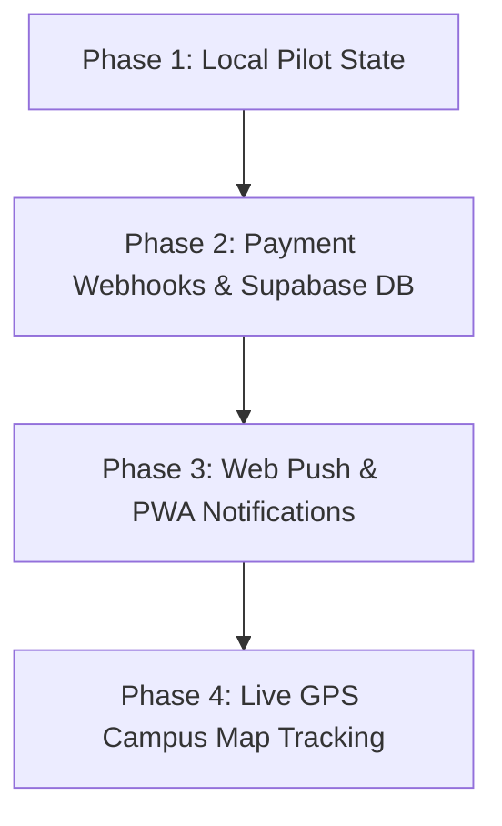

# Campus Runner — Project Audit, Technical Challenges & Enhancement Report

**Date:** September 23, 2026  
**Project:** Campus Runner — Master Campus Food Delivery Platform (`v1.0 PILOT`)  
**Target Environment:** Gated University Campus (Aryabhatta & Bhaskara Hostels, Main Food Courts)  
**Tech Stack:** React 19, Vite 8, TypeScript 7, Zustand 5, Supabase JS v2, Tailwind CSS v4, Lucide React

---

##  EXECUTIVE SUMMARY

**Campus Runner** is a hyper-local, gated campus food delivery platform designed to connect **Students**, **Food Court Stalls (Vendors)**, **Student Runners**, and **University Administration (Wardens)**. 

The application is structured into four role-specific views with centralized Zustand state management, pure business-logic helpers, integer-rupee financial math, table-driven delivery pricing, cutoff & slot timing engines, and Supabase Postgres Realtime integration.

---

## 1. COMPREHENSIVE CODEBASE & ARCHITECTURE OVERVIEW

### Core Modules & Roles

| Role / Module | Key Functionalities | Component File |
| :--- | :--- | :--- |
| **Student View** | Mobile-first Swiggy/Zomato UI, category chips, dish search, single-vendor tray, veg-only hostel filter, table-driven delivery fee, UPI payment modal (QR & `upi://pay` deep link), live tracking screen with 4-digit handover OTP. | [StudentView.tsx](file:///e:/campus%20runner/src/components/student/StudentView.tsx) |
| **Vendor Kitchen** | Live kitchen order queue (Placed $\rightarrow$ Accepted $\rightarrow$ Ready), live item stock toggles (In Stock / Sold Out), real-time menu management, daily integer settlement ledger with commission splits. | [VendorView.tsx](file:///e:/campus%20runner/src/components/vendor/VendorView.tsx) |
| **Runner Shift** | Shift roster identity, batch dispatch queue, packet pickup confirmation, student handover OTP verification modal with confetti celebration, flat payout calculator ($\text{₹}18\text{ base} + \text{₹}25\text{ batch bonus for } \ge 6\text{ orders}$). | [RunnerView.tsx](file:///e:/campus%20runner/src/components/runner/RunnerView.tsx) |
| **Admin & Warden** | Campus master emergency kill-switch, per-hostel block delivery toggles, night cutoff adjustment, manual multi-order batch dispatcher, student runner ID verification, vendor onboarding & commission editor, master audit ledger. | [AdminView.tsx](file:///e:/campus%20runner/src/components/admin/AdminView.tsx) |

### Key Files Map

- **Central Store:** [src/store.ts](file:///e:/campus%20runner/src/store.ts) (Zustand store with `persist` middleware)
- **Order Tracking Store:** [src/orderTrackingStore.ts](file:///e:/campus%20runner/src/orderTrackingStore.ts) (Real-time tracking & Supabase channel management)
- **Pure Business Logic:** [src/business-logic.ts](file:///e:/campus%20runner/src/business-logic.ts) (Fee tables, commission calculations, slot timing, UPI link generator, OTP generator)
- **Data Models:** [src/types.ts](file:///e:/campus%20runner/src/types.ts) (TypeScript interfaces & enums)
- **Seed Data:** [src/seed-data.ts](file:///e:/campus%20runner/src/seed-data.ts) (Realistic pilot mock data)
- **Supabase Connector:** [src/lib/supabase.ts](file:///e:/campus%20runner/src/lib/supabase.ts) (Safe client instantiation & fallback)

---

## 2. DETECTED ISSUES & BUG ANALYSIS

During detailed code audit and execution testing, the following issues and edge cases were identified:

### 🔴 Issue 1: Non-Existent `tsc` Executable in `npm run lint`
- **Location:** `package.json` line 11 (`"lint": "tsc --noEmit"`)
- **Symptom:** Running `npm run lint` fails on systems without a global TypeScript installation, yielding `'tsc' is not recognized as an internal or external command` or trying to run deprecated `tsc@2.0.4`.
- **Root Cause:** `tsc` is not referenced via `npx typescript --noEmit` or local `node_modules` bin script.
- **Fix:** Update `package.json` script:
  ```json
  "lint": "npx typescript --noEmit"
  ```

### 🔴 Issue 2: Cross-Platform `clean` Script Failure on Windows
- **Location:** `package.json` line 10 (`"clean": "rm -rf dist server.js"`)
- **Symptom:** Command fails on Windows PowerShell/CMD because `rm -rf` is Unix-specific.
- **Fix:** Use Node's built-in file removal or cross-platform `rimraf`:
  ```json
  "clean": "node -e \"fs.rmSync('dist', {recursive: true, force: true})\""
  ```

### 🟠 Issue 3: Disconnect between Realtime Connection State and UI Status Text
- **Location:** [StudentView.tsx](file:///e:/campus%20runner/src/components/student/StudentView.tsx#L943-L948) vs [orderTrackingStore.ts](file:///e:/campus%20runner/src/orderTrackingStore.ts#L93-L97)
- **Symptom:** When Supabase credentials (`VITE_SUPABASE_URL`) are not set, `orderTrackingStore` gracefully switches `connectionStatus` to `'local_fallback'`. However, `StudentView.tsx` hardcodes the text `"Postgres Realtime Live"`.
- **Fix:** Dynamically render connection state in `StudentView.tsx`:
  ```tsx
  {connectionStatus === 'connected' ? 'Postgres Realtime Live' : 'In-App Local Reactive Sync'}
  ```

### 🟠 Issue 4: Vendor Onboarding ID Mismatch Risk
- **Location:** [store.ts](file:///e:/campus%20runner/src/store.ts#L544-L561)
- **Symptom:** In `onboardVendor`, `vendorId` is set using `Date.now()`, but menu items mapping creates a second `Date.now()` string (`vendorId: vendor-${Date.now()}`). If executed in the same millisecond or adjacent cycles, vendor ID string comparison can mismatch.
- **Fix:** Capture `const newVendorId = 'vendor-' + Date.now();` and reuse it for all `menuItems`.

---

## 3. TECHNICAL & OPERATIONAL CHALLENGES

1. **Unverified P2P UPI Payment Settlement (Phase 1 Deep Link):**
   - *Challenge:* Direct `upi://pay` links allow zero transaction fees, but the app relies on student self-confirmation ("I Have Paid"). Dishonest users could confirm without completing transfer.
   - *Mitigation:* Handover OTP design prevents order theft, but stall preparation cost remains vulnerable until payment Webhooks are introduced.

2. **Student Runner Shift Availability & Scheduling:**
   - *Challenge:* Student runners are peers with active course schedules. Peak demand hours (8:30 PM Night Slot) coincide with study hours or hall curfews.
   - *Mitigation:* Dynamic batch bonus incentive ($\text{₹}25\text{ bonus for } \ge 6\text{ orders}$) encourages batch consolidation.

3. **Multi-Tab Sync vs Multi-Device Realtime:**
   - *Challenge:* Zustand `persist` syncs state within a single browser storage. Multi-user pilot deployment across distinct mobile devices requires active Supabase backend database persistence.

4. **Strict Vegetarian Hostel Enforcements:**
   - *Challenge:* Bhaskara Hall enforces strict veg-only rules. System must ensure non-veg items from mixed stalls cannot be ordered to veg blocks even via manual address switching.

---

## 4. RECOMMENDED FURTHER ENHANCEMENTS



1. **Automated UPI Payment Webhooks (Razorpay / Cashfree UPI Stack):**
   - Replace manual payment confirmation with instant server-side payment callback status verification before order reaches vendor kitchen queue.

2. **Supabase Database Schema & RLS Security:**
   - Provision Postgres tables (`users`, `vendors`, `menu_items`, `orders`, `order_items`, `settlements`) with Row-Level Security (RLS) policies enforcing role boundaries.

3. **Web Push Notifications (Service Workers):**
   - Send push alerts to students when their order status updates to `OUT_FOR_DELIVERY` and alert runners when new batch orders are assigned.

4. **Interactive Campus Map & Live GPS Pin Movement:**
   - Integrate Leaflet/Mapbox with custom campus building overlays showing live runner position during delivery.

5. **Automated Settlement PDF Exports:**
   - Provide vendors and university financial auditors with one-click daily PDF settlement statements.

---

## 5. VALIDATION & EXECUTION INSTRUCTIONS

To validate, run, and test the project locally, follow these verified steps:

### A. Environment Setup
1. Ensure Node.js (v18+) is installed.
2. Clone/Open the project directory:
   ```bash
   cd "e:/campus runner"
   ```
3. Install project dependencies:
   ```bash
   npm install
   ```

### B. Typecheck & Code Verification
Run TypeScript type checking without emitting build artifacts:
```bash
npx typescript --noEmit
```

### C. Run Development Server
Start Vite local server:
```bash
npm run dev
```
- Open browser at `http://localhost:3000`
- Role Navigation bar at top allows instantaneous switching between **Student**, **Vendor**, **Runner**, and **Admin** personas.

### D. Production Build Verification
Test production bundling:
```bash
npm run build
```

---

*Report filed successfully in workspace artifact [PROJECT_REPORT.md](file:///e:/campus%20runner/PROJECT_REPORT.md).*
