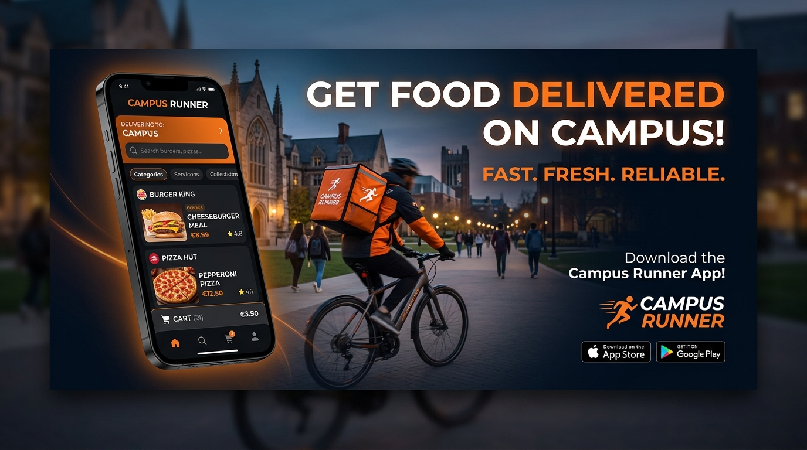
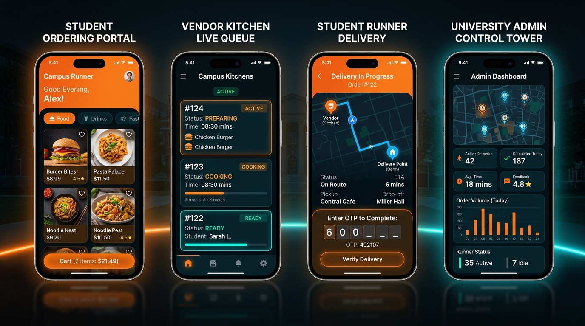

<div align="center">



# ⚡ Campus Runner
### Hyper-Local Gated University Food Delivery & Logistics Platform

[](https://github.com/Chandansoni12/campus-runner/actions/workflows/build-apk.yml)
[](https://github.com/Chandansoni12/campus-runner/releases/tag/v2.0-latest)
[](https://react.dev/)
[](https://www.typescriptlang.org/)
[](https://vitejs.dev/)
[](https://capacitorjs.com/)
[](https://tailwindcss.com/)

<p align="center">
  <b>Connecting Hostel Students, Campus Stalls, Student Delivery Runners, and University Administration.</b><br />
  High-speed 15-minute delivery slots • ₹15 flat hostel runner fee • OTP handover verification • Pure Veg policy enforcement
</p>

[📲 Download Android APK](https://github.com/Chandansoni12/campus-runner/releases/download/v2.0-latest/CampusRunner-v2.0.apk) • [📦 View Releases](https://github.com/Chandansoni12/campus-runner/releases/tag/v2.0-latest) • [✨ View Portals](#-four-dedicated-portals) • [🚀 Quickstart](#-getting-started)

</div>

---

## 📱 Live Four-Portal Architecture

<div align="center">

</div>

Campus Runner is architected as a role-governed ecosystem catering to the four distinct stakeholders of a closed campus community:

| Portal | Role & Responsibilities | Key Features |
| :--- | :--- | :--- |
| **🎓 Student Ordering** | University students residing in campus halls | • **Delivo PWA UI**: Pure black theme (`#000000`) with signature curved orange header (`#FD6931`).<br />• **In-Header Search**: Dish, category, and stall filtering.<br />• **Super Deals & Hot Deals**: Horizontal swipe rail and vertical bestseller lists.<br />• **Slot Picker**: Scheduled delivery windows (Morning, Lunch, Evening, Night).<br />• **Hostel Policy Compliance**: Automatic Pure-Veg filtering for Bhaskara Hall.<br />• **Campus UPI Checkout**: QR code & UPI deep-link payment with zero platform commission. |
| **🍳 Vendor Kitchen** | Campus canteen vendors & food court stalls | • **Live Order Queue**: Real-time order stages (`Placed` → `Accepted` → `Preparing` → `Ready`).<br />• **Stock Availability Controls**: Instant toggle for out-of-stock items.<br />• **Settlement Ledger**: Automated daily gross sales, commission deduction, and net payout tracking. |
| **🏃 Student Runner** | Verified peer student runners earning on campus | • **Mission Batch Roster**: Clustered multi-order pickups across campus stalls.<br />• **Handover OTP Verification**: 4-digit security code confirmation preventing misdelivery.<br />• **Gamified Earnings**: Base ₹18 delivery fee + ₹25 batch bonus for 6+ deliveries with celebratory confetti. |
| **🛡️ University Admin** | Wardens, campus security & food committee | • **Master Emergency Kill-Switch**: One-tap university-wide ordering freeze.<br />• **Hostel Block Toggles**: Independent curfew & pause control for specific hostels.<br />• **Vendor & Runner Onboarding**: Roster verification and commission tier configuration. |

---

## 📲 Download & Install Android APK

You can download and run Campus Runner directly on any Android device:

### Direct Download Link
👉 **[Download CampusRunner-v2.0.apk (Latest Build)](https://github.com/Chandansoni12/campus-runner/releases/download/v2.0-latest/CampusRunner-v2.0.apk)**

### Installation Steps
1. Tap the download link above on your Android phone to save `CampusRunner-v2.0.apk`.
2. Tap the downloaded file in your browser or **Files** manager.
3. If prompted with *"For your security, your phone is not allowed to install unknown apps from this source"*, tap **Settings** and enable **"Allow from this source"**.
4. Tap **Install**, then **Open** to launch Campus Runner!

> **Note**: Automated builds are triggered on every commit via GitHub Actions (`.github/workflows/build-apk.yml`) using **Node.js 22**, **Java 21 Zulu**, and **Gradle 8.14**.

---

## 🎨 UI/UX Design System Highlights (Delivo PWA)

The front-end is crafted following the Delivo PWA design language:

* **Dark Theme Palette**: Curated `#000000` deep black canvas with `#FD6931` energetic orange accents and `#1A1A1A` glassmorphic cards.
* **Signature Header**: Curved bottom corners (`border-radius: 0 0 30px 30px`) in vibrant orange with profile avatar, hostel room location switcher, and notification badges.
* **Integrated Search**: Blur-backed search input situated directly inside the orange header.
* **Fluid Clamp Typography**: Micro-tuned responsive font scales from `--font-10` to `--font-48` ensuring seamless readability across all phone sizes.
* **Sticky Bottom Navigation**: 5-action bottom bar with active indicator dot and real-time order status pings.

---

## 💻 Tech Stack

* **Framework**: [React 19](https://react.dev/) + [Vite 8](https://vitejs.dev/)
* **Language**: [TypeScript 7](https://www.typescriptlang.org/)
* **Mobile Runtime**: [Capacitor 8](https://capacitorjs.com/) (Android SDK 36, Java 21)
* **Styling**: [Tailwind CSS v4](https://tailwindcss.com/) + Custom CSS Custom Properties Design System
* **State Management**: [Zustand 5](https://github.com/pmndrs/zustand) with LocalStorage persistence
* **Icons & Animation**: [Lucide React](https://lucide.dev/), Canvas Confetti, CSS Keyframe Animations
* **CI/CD Pipeline**: GitHub Actions (`build-apk.yml`) with automated Release publishing

---

## 🚀 Getting Started Locally

### Prerequisites
* **Node.js**: `>= 22.0.0`
* **npm**: `>= 10.0.0`
* **Java JDK**: `21` (if building Android APK locally)

### 1. Clone the Repository
```bash
git clone https://github.com/Chandansoni12/campus-runner.git
cd campus-runner
```

### 2. Install Dependencies
```bash
npm install
```

### 3. Run Development Server
```bash
npm run dev
```
Open [http://localhost:3000](http://localhost:3000) in your browser.

### 4. Build Web Production Bundle
```bash
npm run build
```

### 5. Sync & Build Android APK Locally (Optional)
```bash
# Sync web dist to Capacitor Android
npx cap sync android

# Build debug APK with Gradle
cd android
./gradlew assembleDebug --no-daemon
```
The output APK will be generated at `android/app/build/outputs/apk/debug/app-debug.apk`.

---

## 🔒 Security & Campus Privacy

* **OTP Handover**: Orders can only be completed when the recipient student shares their dynamic 4-digit OTP with the delivery runner.
* **Gated Verification**: Strict validation on hostel blocks, room numbers, and vendor kitchen PINs.
* **Non-Custodial Payments**: Payments flow directly peer-to-peer via university student UPI apps without intermediate platform holding accounts.

---

<div align="center">
  <sub>Developed for University Campus Food Delivery • Built with ❤️ using React, Capacitor & Tailwind</sub>
</div>
